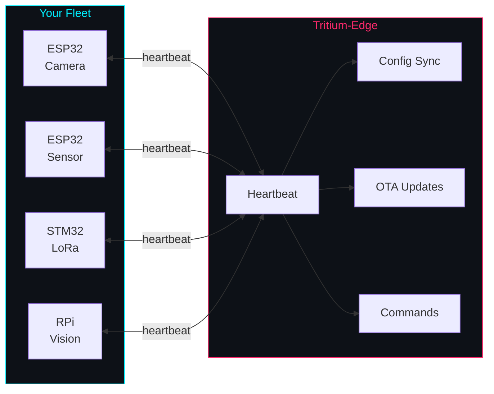

```
 _____ ____  ___ _____ ___ _   _ __  __       _____ ____   ____ _____
|_   _|  _ \|_ _|_   _|_ _| | | |  \/  |     | ____|  _ \ / ___| ____|
  | | | |_) || |  | |  | || | | | |\/| |_____|  _| | | | | |  _|  _|
  | | |  _ < | |  | |  | || |_| | |  | |_____| |___| |_| | |_| | |___
  |_| |_| \_\___| |_| |___|\___/|_|  |_|     |_____|____/ \____|_____|
```

<div align="center">

# Software Defined IoT

**Same hardware, different behavior. Change the config, change the device.**

The nervous system of the [Tritium](https://github.com/Valpatel/tritium) mesh.

</div>

---

## The Problem

You flash firmware to a microcontroller and it does one thing. Want it to do
something different? Reflash it. Want to manage 50 of them? Good luck. Want
to mix ESP32s with STM32s and Raspberry Pis? Write three different codebases.

## The Solution

Tritium-Edge manages **heterogeneous edge device fleets** from a single server.
Devices self-describe their capabilities. The server adapts. Change a product
profile and every device with that profile reconfigures itself — no reflash.



- **Fleet management** — Register, monitor, and organize devices across orgs
- **Product profiles** — Define what a device does. Assign a profile, device reconfigures
- **OTA updates** — 7 delivery pathways: WiFi, BLE, serial, SD card, mesh, USB, HTTP
- **Config sync** — Server tracks desired vs reported config, pushes on drift
- **Remote commands** — Reboot, GPIO control, diagnostics, sleep via heartbeat
- **Multi-tenant** — Organizations, users, roles
- **Multi-family hardware** — ESP32 first, then STM32, nRF52, ARM Linux SBCs
- **Self-replicating** — Nodes carry firmware, models, and configs. New nodes bootstrap from any peer

## Supported Boards (ESP32-S3)

| Board | Display | Peripherals | Status |
|-------|---------|-------------|--------|
| Touch-AMOLED-2.41-B | 450x600 RM690B0 QSPI | Touch | Verified |
| Touch-LCD-3.5B-C | 320x480 AXS15231B QSPI | Touch, Camera, Audio, IMU, PMIC, RTC, SD | Verified |
| Touch-LCD-3.49 | 172x640 AXS15231B QSPI | Touch | Verified |
| Touch-LCD-4.3C-BOX | 800x480 ST7262 RGB | Touch | Pin-verified |
| Touch-AMOLED-1.8 | 368x448 SH8601Z QSPI | Touch | Compiles |
| AMOLED-1.91-M | 240x536 RM67162 QSPI | -- | Compiles |

## Quick Start

```bash
# Flash firmware
./scripts/flash.sh touch-lcd-35bc              # Default app
./scripts/flash.sh touch-lcd-35bc camera       # Camera app
./scripts/monitor.sh                           # Serial monitor

# Start the server
cd server && ./start.sh                        # http://localhost:8080

# Or use Make
make flash BOARD=touch-lcd-35bc APP=system
make list-boards
make list-apps
```

## Go Deeper

All the detail lives in `docs/`:

| Document | What It Covers |
|----------|---------------|
| [ARCHITECTURE.md](docs/ARCHITECTURE.md) | System architecture, data models, auth, phases |
| [DEVICE-PROTOCOL.md](docs/DEVICE-PROTOCOL.md) | Heartbeat v2, config sync, commands |
| [MULTI-TENANT.md](docs/MULTI-TENANT.md) | Orgs, users, roles, permissions |
| [HARDWARE-ABSTRACTION.md](docs/HARDWARE-ABSTRACTION.md) | PAL, shared drivers, multi-family |
| [PLUGIN-SYSTEM.md](docs/PLUGIN-SYSTEM.md) | Server plugin architecture |
| [INTEGRATION.md](docs/INTEGRATION.md) | Connecting to tritium-sc and tritium-lib |
| [ADDING_AN_APP.md](docs/ADDING_AN_APP.md) | Create a new firmware app |
| [ADDING_A_BOARD.md](docs/ADDING_A_BOARD.md) | Add a new board |

## Part of Tritium

Tritium-Edge is the **nervous system** of the
[Tritium Distributed Cybernetic Operating System](https://github.com/Valpatel/tritium).
It works alongside [tritium-sc](https://github.com/Valpatel/tritium-sc) (the brain)
and [tritium-lib](https://github.com/Valpatel/tritium-lib) (the spine).

---

<div align="center">

*Created by Matthew Valancy / Copyright 2026 Valpatel Software LLC / AGPL-3.0*

</div>
