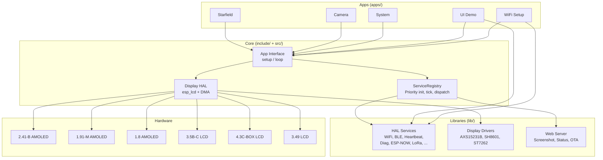

# Tritium-Edge — Software Defined IoT

Multi-board ESP32-S3 fleet firmware targeting 6 Waveshare development boards. Supports AMOLED (QSPI), IPS LCD (QSPI), and IPS LCD (RGB parallel) displays through a unified app architecture with ServiceRegistry-based HAL management, fleet heartbeat, remote diagnostics, ESP-NOW mesh, BLE scanning, OTA updates, and an embedded web server.

## Supported Boards

| Environment | Board | Resolution | Display | Status |
|---|---|---|---|---|
| `touch-amoled-241b` | ESP32-S3-Touch-AMOLED-2.41-B | 450x600 | RM690B0 QSPI | HW Verified |
| `amoled-191m` | ESP32-S3-AMOLED-1.91-M | 240x536 | RM67162 QSPI | Needs verification |
| `touch-amoled-18` | ESP32-S3-Touch-AMOLED-1.8 | 368x448 | SH8601Z QSPI | Needs verification |
| `touch-lcd-35bc` | ESP32-S3-Touch-LCD-3.5B-C | 320x480 | AXS15231B QSPI | HW Verified |
| `touch-lcd-43c-box` | ESP32-S3-Touch-LCD-4.3C-BOX | 800x480 | ST7262 RGB | Pin-verified |
| `touch-lcd-349` | ESP32-S3-Touch-LCD-3.49 | 172x640 | AXS15231B QSPI | HW Verified |

All boards share: ESP32-S3 dual-core 240MHz, 16MB flash, 8MB PSRAM, WiFi, BLE 5, USB-C.

## Quick Start

```bash
./scripts/setup.sh           # One-time: install PlatformIO + USB permissions
./scripts/build.sh touch-lcd-35bc          # Build starfield demo
./scripts/flash.sh touch-lcd-35bc          # Build + flash (auto-detects port)
./scripts/flash.sh touch-lcd-35bc camera   # Flash camera app
./scripts/monitor.sh                       # Serial monitor
./scripts/identify.sh                      # Detect connected boards
```

Or use Make:

```bash
make build BOARD=touch-lcd-35bc
make flash BOARD=touch-lcd-35bc APP=camera
make monitor
make list-boards
```

Or PlatformIO directly:

```bash
pio run -e touch-lcd-35bc-camera -t upload
```

## Project Structure

Each directory has its own README.md with mermaid diagrams — click through on GitHub for details.

```
tritium-edge/
├── src/                      Firmware entry point (main.cpp)
├── include/                  Shared headers (app.h, display_init.h, lv_conf.h)
│   └── boards/               Per-board pin definitions (one .h per board)
├── apps/                     Application implementations
│   ├── starfield/            Default demo (3D starfield animation)
│   ├── camera/               Camera preview (boards with OV5640)
│   ├── system/               Full hardware dashboard (all peripherals)
│   ├── ui_demo/              LVGL UI demo
│   ├── wifi_setup/           WiFi configuration UI
│   └── _template/            Skeleton for new apps
├── lib/                      Shared libraries (display drivers, HALs, utilities)
├── scripts/                  Dev workflow (build, flash, monitor, identify, setup)
├── tools/                    Utilities (board detection)
├── sim/                      Desktop simulator (SDL2)
├── docs/                     Documentation guides
├── references/               Official Waveshare demo code (not committed)
├── platformio.ini            Build configuration
└── Makefile                  Build automation
```

## Architecture

Board selection and app selection are orthogonal — any app can run on any board.



- **Board selection**: Compile-time via `-DBOARD_*` flag. Board-specific display configs in `lib/display/boards/` select the correct esp_lcd panel driver, SPI pins, and init sequence.
- **App selection**: Compile-time via `-DAPP_*` flag. `main.cpp` instantiates the selected app. Reusable `[app_*]` sections in `platformio.ini` define what gets compiled.
- **App interface**: All apps inherit from `App` with virtual `setup(esp_lcd_panel_handle_t, w, h)` and `loop()`. Apps render to a PSRAM framebuffer and push via DMA.
- **Service architecture**: HALs are wrapped as `ServiceInterface` adapters, managed by `ServiceRegistry`. Priority-ordered init, tick dispatch, serial command routing, JSON status.

See [docs/ARCHITECTURE.md](docs/ARCHITECTURE.md) for details.

## Documentation

- [docs/GETTING_STARTED.md](docs/GETTING_STARTED.md) — Setup, first build, first flash
- [docs/ARCHITECTURE.md](docs/ARCHITECTURE.md) — System design and decisions
- [docs/ADDING_AN_APP.md](docs/ADDING_AN_APP.md) — How to create a new app
- [docs/ADDING_A_BOARD.md](docs/ADDING_A_BOARD.md) — How to add a new board
- [docs/boards.md](docs/boards.md) — Detailed board specs and links
