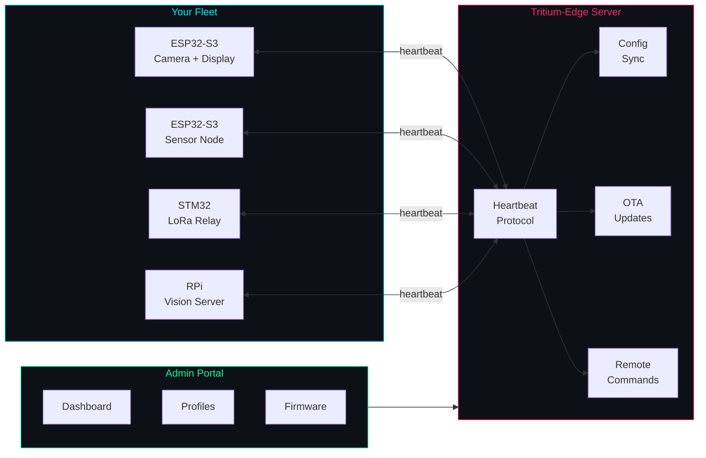
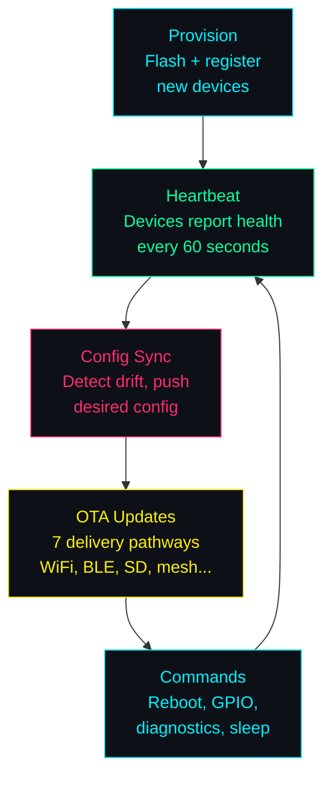
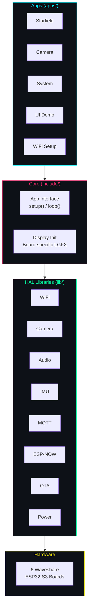

```
 _____ ____  ___ _____ ___ _   _ __  __       _____ ____   ____ _____
|_   _|  _ \|_ _|_   _|_ _| | | |  \/  |     | ____|  _ \ / ___| ____|
  | | | |_) || |  | |  | || | | | |\/| |_____|  _| | | | | |  _|  _|
  | | |  _ < | |  | |  | || |_| | |  | |_____| |___| |_| | |_| | |___
  |_| |_| \_\___| |_| |___|\___/|_|  |_|     |_____|____/ \____|_____|
```

<div align="center">

# Software Defined IoT

**Same hardware, different behavior. Change the config, change the device.**

The nervous system of the [Tritium](https://github.com/Valpatel/tritium) mesh.

</div>

---

## The Problem

You flash firmware to a microcontroller and it does one thing. Want it to do
something different? Reflash it. Want to manage 50 of them? Good luck. Want
to mix ESP32s with STM32s and Raspberry Pis? Write three different codebases.

## The Solution

Tritium-Edge manages **heterogeneous edge device fleets** from a single server.
Devices self-describe their capabilities. The server adapts. Change a product
profile and every device with that profile reconfigures itself — no reflash
needed.



## What It Does



- **Fleet management** — Register, monitor, and organize devices across orgs
- **Product profiles** — Define what a device does. Assign a profile, device reconfigures
- **OTA updates** — 7 delivery pathways: WiFi, BLE, serial, SD card, mesh, USB, HTTP
- **Remote config** — Server tracks desired vs reported config, pushes on drift
- **Remote commands** — Reboot, GPIO control, diagnostics, sleep — delivered via heartbeat
- **Multi-tenant** — Organizations, users, roles. Your friends get their own accounts
- **Multi-family hardware** — ESP32 first, then STM32, nRF52, ARM Linux SBCs

## Supported Hardware (ESP32-S3 Family)

| Board | Resolution | Display | Peripherals | Status |
|-------|-----------|---------|-------------|--------|
| Touch-AMOLED-2.41-B | 450x600 | RM690B0 QSPI | Touch | HW Verified |
| AMOLED-1.91-M | 240x536 | RM67162 QSPI | -- | Compiles |
| Touch-AMOLED-1.8 | 368x448 | SH8601Z QSPI | Touch | Compiles |
| Touch-LCD-3.5B-C | 320x480 | AXS15231B QSPI | Touch, Camera, Audio, IMU, PMIC, RTC, SD | HW Verified |
| Touch-LCD-4.3C-BOX | 800x480 | ST7262 RGB | Touch | Pin-verified |
| Touch-LCD-3.49 | 172x640 | AXS15231B QSPI | Touch | HW Verified |

All boards: ESP32-S3 dual-core 240MHz, 16MB flash, 8MB PSRAM, WiFi, BLE 5, USB-C.

## Quick Start

### Firmware (flash a device)

```bash
./scripts/flash.sh touch-lcd-35bc              # Flash default app
./scripts/flash.sh touch-lcd-35bc camera       # Flash camera app
./scripts/monitor.sh                           # Serial monitor
./scripts/identify.sh                          # Detect connected boards
```

### Server (manage the fleet)

```bash
cd server && ./start.sh                        # http://localhost:8080
```

### Make shortcuts

```bash
make build BOARD=touch-lcd-35bc APP=system
make flash BOARD=touch-lcd-35bc
make monitor
make list-boards
make list-apps
```

## Architecture At A Glance



- **Board selection** — Compile-time via `-DBOARD_*`. Each board gets its own display init.
- **App selection** — Compile-time via `-DAPP_*`. Any app runs on any board.
- **HAL libraries** — Self-contained hardware abstractions. Dual-mode I2C for bus sharing.
- **Management server** — FastAPI + Pydantic. Heartbeat v2, JWT auth, multi-tenant.

## Documentation

All the detail lives in `docs/`:

| Document | What It Covers |
|----------|---------------|
| [ARCHITECTURE.md](docs/ARCHITECTURE.md) | Full system architecture, data models, auth, implementation phases |
| [DEVICE-PROTOCOL.md](docs/DEVICE-PROTOCOL.md) | Heartbeat v2, config sync, command lifecycle |
| [MULTI-TENANT.md](docs/MULTI-TENANT.md) | Orgs, users, roles, permissions |
| [HARDWARE-ABSTRACTION.md](docs/HARDWARE-ABSTRACTION.md) | PAL, shared drivers, BSP — multi-family hardware support |
| [PLUGIN-SYSTEM.md](docs/PLUGIN-SYSTEM.md) | Server plugin architecture and hooks |
| [INTEGRATION.md](docs/INTEGRATION.md) | How tritium-edge connects to tritium-sc and tritium-lib |
| [GETTING_STARTED.md](docs/GETTING_STARTED.md) | Setup, first build, first flash |
| [ADDING_AN_APP.md](docs/ADDING_AN_APP.md) | How to create a new firmware app |
| [ADDING_A_BOARD.md](docs/ADDING_A_BOARD.md) | How to add a new board |

## Part of Tritium

Tritium-Edge is the **nervous system** of the
[Tritium Distributed Cybernetic Operating System](https://github.com/Valpatel/tritium).
It works alongside [tritium-sc](https://github.com/Valpatel/tritium-sc) (the brain)
and [tritium-lib](https://github.com/Valpatel/tritium-lib) (the spine).

---

<div align="center">

*Created by Matthew Valancy / Copyright 2026 Valpatel Software LLC / AGPL-3.0*

</div>
