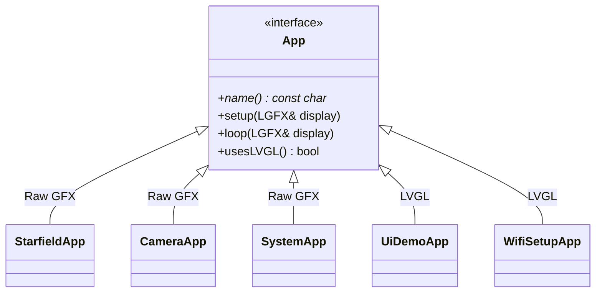

# Apps

This directory contains application implementations for the ESP32 multi-board display firmware project. Each subdirectory is a self-contained app that inherits from the `App` base class defined in the core framework.

## Architecture



Apps either render directly via LovyanGFX or use LVGL for widget-based UIs. The `usesLVGL()` method tells the framework which path to take.

## Available Apps

| App | Directory | Flag | Description | Rendering |
|-----|-----------|------|-------------|-----------|
| Starfield | `starfield/` | `APP_STARFIELD` | 3D starfield animation demo | Raw LovyanGFX |
| Camera | `camera/` | `APP_CAMERA` | OV5640 camera preview (boards with camera) | Raw LovyanGFX |
| System | `system/` | `APP_SYSTEM` | Full hardware dashboard (IMU, RTC, PMIC, audio, etc.) | Raw LovyanGFX |
| UI Demo | `ui_demo/` | `APP_UI_DEMO` | LVGL widget showcase | LVGL |
| WiFi Setup | `wifi_setup/` | `APP_WIFI_SETUP` | WiFi network configuration UI | LVGL |
| Template | `_template/` | — | Skeleton for new apps | — |

## Creating a New App

Copy the `_template/` directory and follow the step-by-step guide in [`../docs/ADDING_AN_APP.md`](../docs/ADDING_AN_APP.md).

## Build & Flash

Specify the board and app name when building:

```bash
./scripts/build.sh touch-lcd-35bc camera
./scripts/flash.sh touch-lcd-35bc camera
```
