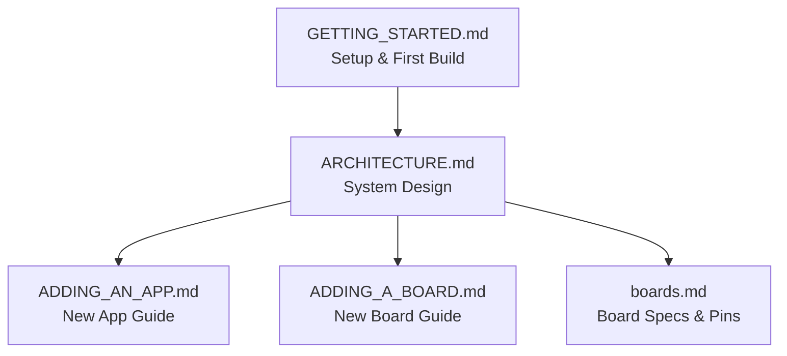

# Documentation Index

Project documentation for the ESP32 multi-board display firmware.

## How the Docs Relate

## Documents

| Document | Description |
|----------|-------------|
| [GETTING_STARTED.md](GETTING_STARTED.md) | Environment setup, first build, first flash, troubleshooting |
| [ARCHITECTURE.md](ARCHITECTURE.md) | System design: board abstraction, app interface, build system, HALs |
| [ADDING_AN_APP.md](ADDING_AN_APP.md) | Step-by-step guide to creating a new app with app presets |
| [ADDING_A_BOARD.md](ADDING_A_BOARD.md) | How to add support for a new ESP32-S3 display board |
| [boards.md](boards.md) | Detailed specs, pin assignments, and wiki links for all 6 boards |

## Quick Links

- [Project README](../README.md)
- [CLAUDE.md Dev Notes](../CLAUDE.md)
