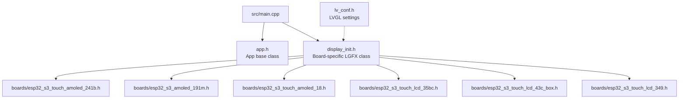

# include/

Shared headers for board abstraction, display initialization, app interface, and LVGL configuration.

## Header Dependency Graph

## Files

| File | Purpose |
|------|---------|
| `app.h` | Base `App` class interface — all apps implement `setup()`, `loop()`, `name()` |
| `display_init.h` | Board-specific `LGFX` class definitions (one per `#if BOARD_*` block). Configures LovyanGFX bus, panel, touch, and backlight for each board. |
| `lv_conf.h` | LVGL 9.2 build configuration (color depth, memory, fonts, widgets) |
| `boards/` | Per-board pin definition headers ([details](boards/README.md)) |

> **Note:** Board headers are force-included via `-include` in platformio.ini build flags, so all compilation units (including HAL libraries) have access to pin defines and `HAS_*` feature flags.
