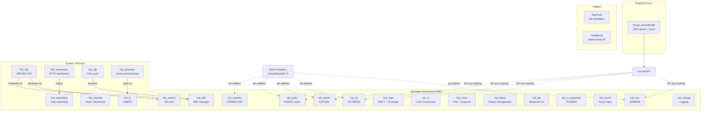

# Shared Libraries

Libraries in `lib/` are organized into three categories:

## Display Drivers

Custom LovyanGFX panel/touch drivers for display ICs not in upstream LovyanGFX.

| Library | Description |
|---------|-------------|
| `Panel_AXS15231B/` | QSPI panel driver for AXS15231B LCD (320x480 + 172x640 variants). Includes full register init sequences and `Touch_AXS15231B` touch driver with 4-byte I2C handshake. |

## Hardware Abstraction (HAL)

Each `hal_*` library wraps a specific hardware peripheral with a clean C++ API. HALs are board-agnostic — they read pin definitions from the board header at compile time.

| Library | Hardware | Key Class | Notes |
|---------|----------|-----------|-------|
| `hal_audio/` | ES8311 codec + I2S | `AudioHAL` | Mic input, speaker output, spectrum analysis |
| `hal_camera/` | OV5640 DVP | `CameraHAL` | Capture RGB565/JPEG/grayscale, resolution control |
| `hal_imu/` | QMI8658 6-axis | `ImuHAL` | Accelerometer + gyroscope, dual I2C mode |
| `hal_rtc/` | PCF85063 RTC | `RtcHAL` | Date/time, alarms, dual I2C mode |
| `hal_power/` | AXP2101 PMIC | `PowerHAL` | Battery level, charging, ADC fallback |
| `hal_sdcard/` | SD card (SDMMC) | `SdCardHAL` | 1-bit SDMMC interface |
| `hal_touch/` | Touch input | `TouchHAL` | Generic touch abstraction |
| `hal_wifi/` | WiFi | `WifiManager` | Multi-network, NVS persistence, auto-reconnect |
| `hal_mqtt/` | MQTT | `MqttHAL` | PubSubClient wrapper, wildcard topics, AI bridge |
| `hal_voice/` | Voice processing | `VoiceHAL` | VAD + MFCC keyword spotting |
| `hal_sleep/` | Power management | `SleepHAL` | Light/deep sleep with wake sources |
| `hal_ble/` | Bluetooth LE | `BleManager` | BLE connectivity |
| `hal_io_expander/` | TCA9554 I/O expander | `IoExpanderHAL` | I2C GPIO expander |
| `hal_ui/` | LVGL UI framework | `ui_init` | LVGL display driver, theme, widgets |
| `hal_debug/` | Debug logging | `DebugLog` | Multi-backend logging (serial, BLE) |

### System Services

| Library | Function | Key Class | Notes |
|---------|----------|-----------|-------|
| `hal_fs/` | LittleFS flash storage | `FsHAL` | File I/O, config helpers, format, performance test harness |
| `hal_ota/` | OTA firmware updates | `OtaHAL` | WiFi push/pull, SD card OTA, dual partition rollback |
| `hal_espnow/` | ESP-NOW mesh networking | `EspNowHAL` | Multi-hop flooding, dedup, discovery, RSSI tracking |
| `hal_webserver/` | HTTP server + dashboard | `WebServerHAL` | Dark neon dashboard, REST API, mDNS, config editor |
| `hal_watchdog/` | Task watchdog + health | `WatchdogHAL` | esp_task_wdt, heap metrics, loop timing, fragmentation |
| `hal_ntp/` | NTP time sync | `NtpHAL` | configTime(), timezone, drift estimation |
| `hal_provision/` | Device provisioning | `ProvisionHAL` | SD/USB cert import, device identity, factory WiFi |

### Dual I2C Mode

Several HALs (IMU, RTC, Power, Audio) support two I2C backends:
- `init(TwoWire&)` — standalone mode using Arduino Wire
- `initLgfx(port, addr)` — shared mode using LovyanGFX's internal I2C

Use `initLgfx()` when the HAL shares an I2C bus with the LovyanGFX touch driver (which owns the bus via `lgfx::i2c`). Using Arduino Wire on the same port will cause conflicts.

## Utility Libraries

Reusable engines and algorithms not tied to specific hardware.

| Library | Description |
|---------|-------------|
| `StarField/` | 3D starfield simulation engine with configurable star count and speed |
| `GfxEffects/` | Demoscene graphics effects — 7 neon-themed effects (plasma, fire, matrix, etc.) |

## Adding a New Library

1. Create `lib/<name>/` with `.h` and `.cpp` files
2. For HALs: follow the `hal_*` naming convention
3. Add `-Ilib/<name>` to the relevant `[app_*]` build_flags in `platformio.ini`
4. Add `+<../lib/<name>/>` to the `build_src_filter`
5. Libraries are only compiled when explicitly included in an app's source filter
