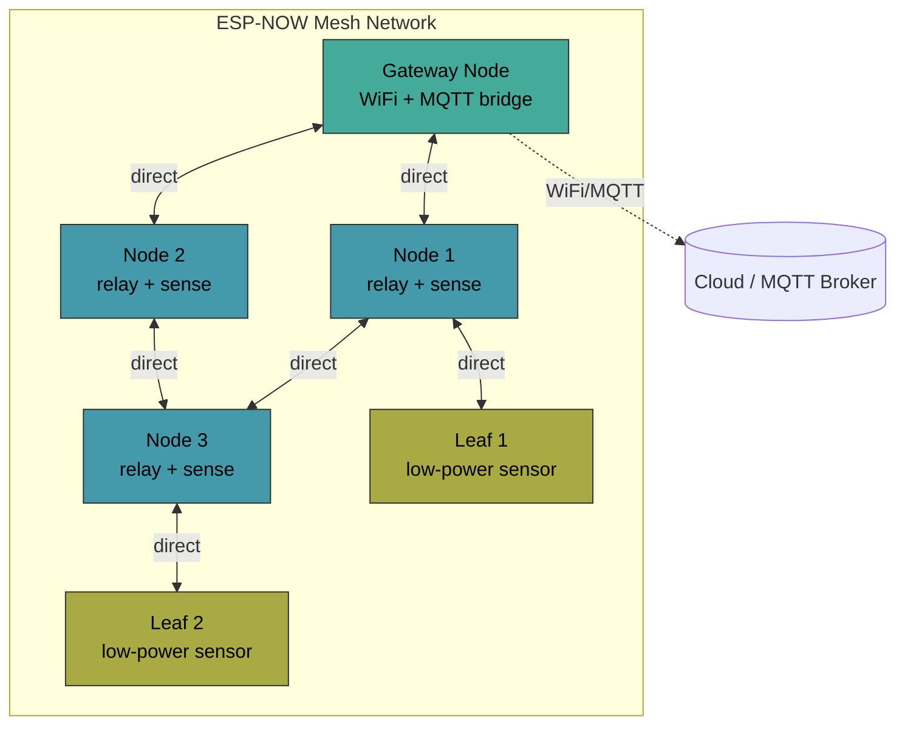
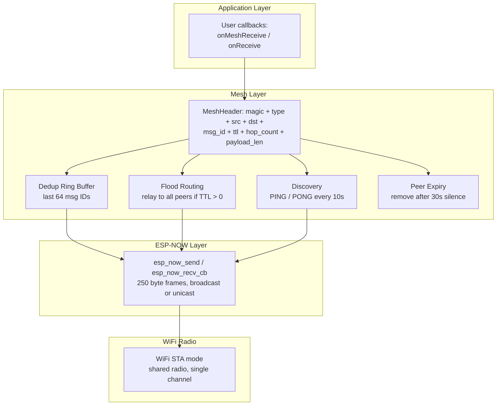
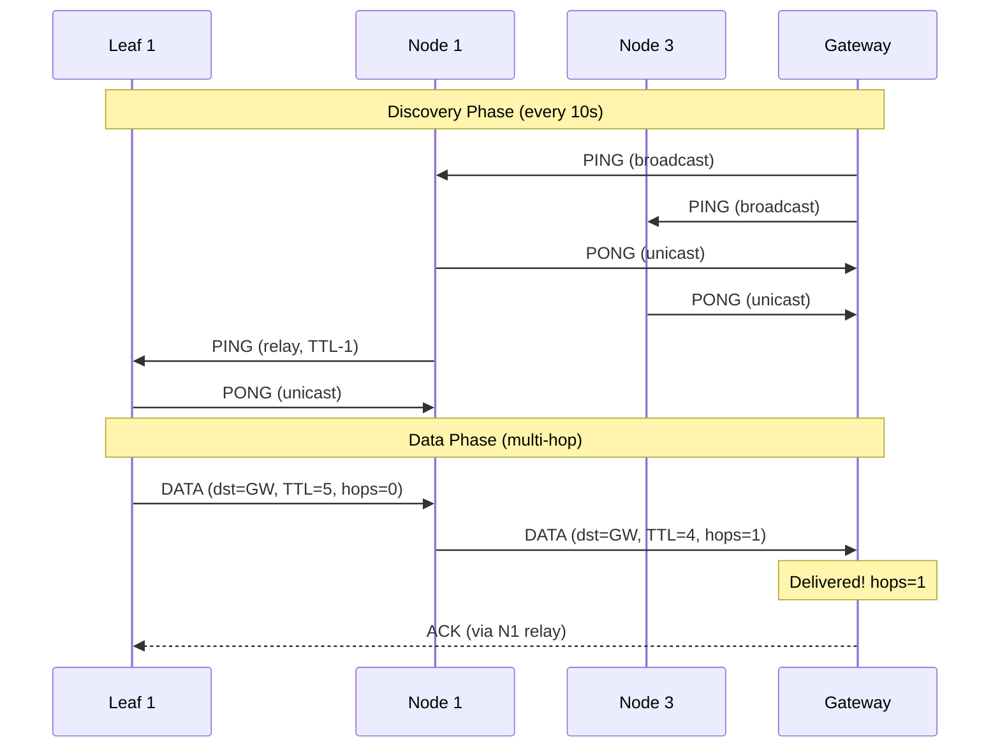

# hal_espnow -- ESP-NOW Mesh Networking HAL

Hardware abstraction layer for ESP-NOW with multi-hop mesh networking support.
Designed for 6 Waveshare ESP32-S3 boards communicating peer-to-peer without
a WiFi access point, while coexisting with WiFi STA mode.

## Architecture

### Mesh Topology



### Protocol Stack



### Message Flow (Multi-Hop)



## Roles

| Role | Sends | Receives | Relays | WiFi |
|------|-------|----------|--------|------|
| **NODE** | Yes | Yes | Yes | Optional |
| **GATEWAY** | Yes | Yes | Yes | Active (MQTT bridge) |
| **LEAF** | Yes | Yes | No | No (saves power) |

## Usage

### Basic Peer-to-Peer

```cpp
#include "hal_espnow.h"

EspNowHAL espnow;

void setup() {
    espnow.init(EspNowRole::NODE, 1);

    // Register raw receive callback
    espnow.onReceive([](const uint8_t* mac, const uint8_t* data,
                        uint8_t len, int8_t rssi) {
        Serial.printf("From %02X:%02X:%02X:%02X:%02X:%02X rssi=%d: ",
                      mac[0], mac[1], mac[2], mac[3], mac[4], mac[5], rssi);
        Serial.write(data, len);
        Serial.println();
    });

    // Send to a specific peer
    uint8_t peer[6] = {0xAA, 0xBB, 0xCC, 0xDD, 0xEE, 0xFF};
    espnow.addPeer(peer);
    espnow.send(peer, (const uint8_t*)"hello", 5);

    // Broadcast to all
    espnow.broadcast((const uint8_t*)"announce", 8);
}

void loop() {
    // No process() needed for raw peer-to-peer
}
```

### Mesh Networking

```cpp
#include "hal_espnow.h"

EspNowHAL espnow;

void setup() {
    // Gateway node: bridges mesh to WiFi/MQTT
    espnow.init(EspNowRole::GATEWAY, 1);

    // Register mesh receive callback (gets data after multi-hop routing)
    espnow.onMeshReceive([](const uint8_t* origin, const uint8_t* data,
                            uint8_t len, uint8_t hops) {
        Serial.printf("Mesh from %02X:%02X:%02X:%02X:%02X:%02X hops=%d: ",
                      origin[0], origin[1], origin[2],
                      origin[3], origin[4], origin[5], hops);
        Serial.write(data, len);
        Serial.println();
    });
}

void loop() {
    // Must call process() for mesh maintenance:
    // - periodic discovery (every 10s)
    // - peer expiry (30s timeout)
    espnow.process();

    // Send data to a specific node via mesh (auto-routed)
    uint8_t target[6] = {0x11, 0x22, 0x33, 0x44, 0x55, 0x66};
    espnow.meshSend(target, (const uint8_t*)"sensor:23.5", 11);

    // Or broadcast to all mesh nodes
    espnow.meshBroadcast((const uint8_t*)"alert:high-temp", 15);

    delay(1000);
}
```

### Running the Test Harness

```cpp
#include "hal_espnow.h"

EspNowHAL espnow;

void setup() {
    Serial.begin(115200);

    espnow.init(EspNowRole::NODE, 1);
    auto result = espnow.runTest(10);  // 10-second discovery window

    Serial.printf("Init: %s\n", result.init_ok ? "PASS" : "FAIL");
    Serial.printf("MAC:  %s\n", result.mac_ok ? "PASS" : "FAIL");
    Serial.printf("Broadcast: %s\n", result.broadcast_ok ? "PASS" : "FAIL");
    Serial.printf("Peer add:  %s\n", result.peer_add_ok ? "PASS" : "FAIL");
    Serial.printf("Discovery: %s\n", result.mesh_discovery_ok ? "PASS" : "FAIL");
    Serial.printf("Peers found: %d\n", result.peers_found);
    Serial.printf("Best RSSI:  %d dBm\n", result.best_rssi);
    Serial.printf("Worst RSSI: %d dBm\n", result.worst_rssi);
    Serial.printf("Avg RTT:    %lu us\n", result.avg_rtt_us);
    Serial.printf("TX: %lu  RX: %lu  Fail: %lu  Relay: %lu\n",
                  result.stats.tx_count, result.stats.rx_count,
                  result.stats.tx_fail, result.stats.relay_count);
}

void loop() {
    espnow.process();
}
```

## Mesh Protocol Details

- **Magic byte**: `0xE5` identifies mesh-framed packets vs raw ESP-NOW data
- **Dedup**: Rolling buffer of 64 most recent message IDs; duplicates are dropped
- **TTL**: Default 5 hops; decremented on each relay; packet dropped when TTL=0
- **Discovery**: Broadcast PING every 10 seconds; peers respond with PONG
- **Peer expiry**: Peers not seen for 30 seconds are removed from the table
- **Flooding**: Non-leaf nodes relay all mesh packets to broadcast (with dedup)
- **Coexistence**: ESP-NOW shares the WiFi STA radio; no AP mode required

## Packet Layout

```
Byte offset  Field           Size
-----------  --------------  -----
0            magic (0xE5)    1
1            type            1
2..7         src MAC         6
8..13        dst MAC         6
14..15       msg_id          2
16           ttl             1
17           hop_count       1
18           payload_len     1
19..N        payload         0-240
```

Total header: 19 bytes. Max payload: 240 bytes (250 ESP-NOW limit minus header minus margin).
