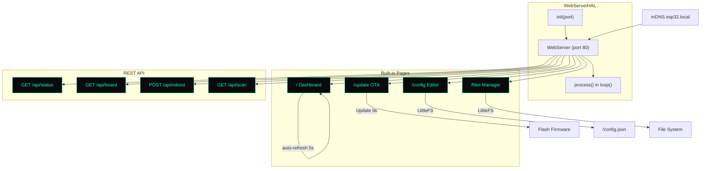

# hal_webserver

ESP32 WebServer HAL library providing an embedded HTTP server with a dark neon hacker-themed web interface. Built on the ESP32 Arduino built-in `WebServer` class (no AsyncWebServer dependency).

## Architecture



## Visual Theme

All pages use a **dark neon hacker theme**:

- **Background:** `#0a0a0a` (near-black)
- **Text:** `#c0c0c0` (light gray)
- **Accents:** `#00ffd0` (neon cyan) for headings, links, buttons, bar fills
- **Cards:** `#111` with subtle `#00ffd022` borders
- **Font:** `Courier New` monospace throughout
- **Danger buttons:** `#ff3366` (neon red) for destructive actions
- **Layout:** Centered single-column, max-width 900px, minimal padding

## Usage

```cpp
#include "hal_webserver.h"

WebServerHAL web;

void setup() {
    // WiFi must be connected first
    web.init(80);
    web.addDashboard();
    web.addOtaPage();
    web.addConfigEditor();
    web.addFileManager();
    web.addApiEndpoints();
    web.startMDNS("esp32");
}

void loop() {
    web.process();
}
```

## Pages

### Dashboard (`/`)
System info table showing board name, MAC, IP, uptime, free heap, PSRAM usage, WiFi RSSI with signal bar. Auto-refreshes every 5 seconds. Navigation links to all other pages.

### OTA Update (`/update`)
Firmware upload form with JavaScript progress bar. Uses the ESP32 `Update` library to write firmware to flash. Shows success/fail status and auto-redirects after reboot.

### Config Editor (`/config`)
Loads `/config.json` from LittleFS into a textarea. Save button POSTs the edited JSON back to the filesystem. Integrates with `hal_fs` when available.

### File Manager (`/files`)
Lists all files on LittleFS with sizes in a table. Upload button for adding new files. Delete button (red) for removing files. Simple and functional.

## API Reference

| Method | Endpoint | Description | Response |
|--------|----------|-------------|----------|
| GET | `/api/status` | System status | `{"uptime_s", "free_heap", "psram_free", "rssi", "ip", "requests"}` |
| GET | `/api/board` | Board info | `{"board", "mac", "flash_size", "psram_size", "cpu_freq", "sdk"}` |
| POST | `/api/reboot` | Trigger reboot | `{"status": "rebooting"}` |
| GET | `/api/scan` | WiFi scan | `{"count", "networks": [{"ssid", "rssi", "channel", "encryption"}]}` |

### Example API usage

```bash
# Get system status
curl http://esp32.local/api/status

# Get board info
curl http://esp32.local/api/board

# Scan for WiFi networks
curl http://esp32.local/api/scan

# Reboot the device
curl -X POST http://esp32.local/api/reboot
```

## Custom Routes

Register additional handlers using the `on()` method:

```cpp
web.on("/custom", "GET", [](void* srv) {
    WebServer* server = (WebServer*)srv;
    server->send(200, "text/plain", "Hello");
});
```

## Test Harness

```cpp
auto result = web.runTest();
// result.init_ok, result.mdns_ok, result.dashboard_ok, result.api_ok
// result.port, result.ip, result.test_duration_ms
```

## Simulator

All methods are stubbed to return `false` / no-op when compiled with `-DSIMULATOR`.

## Dependencies

- ESP32 Arduino core (`WebServer.h`, `ESPmDNS.h`, `Update.h`)
- `LittleFS` (for config editor and file manager)
- `hal_debug` (`debug_log.h`) for logging
