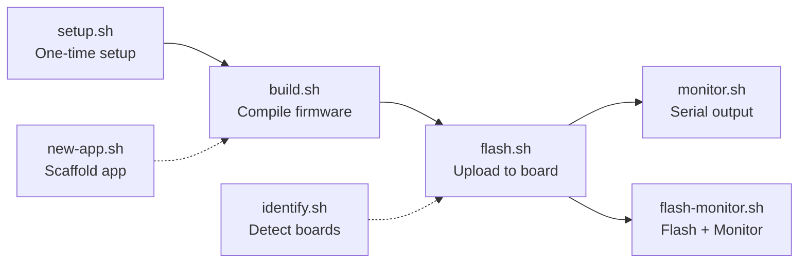

# Scripts

Development workflow scripts for building, flashing, monitoring, and identifying ESP32-S3 boards. These scripts wrap PlatformIO commands with auto-detection and permission handling.

## Workflow



## Scripts

| Script | Usage | Description |
|--------|-------|-------------|
| `setup.sh` | `./scripts/setup.sh` | One-time environment setup: installs PlatformIO, udev rules, USB permissions |
| `build.sh` | `./scripts/build.sh BOARD [APP]` | Compile firmware for a board+app combination |
| `flash.sh` | `./scripts/flash.sh BOARD [APP]` | Build and flash to a connected board (auto-detects port, fixes permissions) |
| `monitor.sh` | `./scripts/monitor.sh [PORT] [BAUD]` | Open serial monitor (auto-detects port, default 115200 baud) |
| `flash-monitor.sh` | `./scripts/flash-monitor.sh BOARD [APP]` | Flash firmware then immediately open serial monitor |
| `identify.sh` | `./scripts/identify.sh` | Detect connected boards via USB (sends IDENTIFY command, reads JSON response) |
| `new-app.sh` | `./scripts/new-app.sh NAME` | Create a new app from the `apps/_template/` skeleton |

## Examples

```bash
# First time setup
./scripts/setup.sh

# Build and flash the starfield demo
./scripts/flash.sh touch-amoled-241b

# Build and flash the camera app
./scripts/flash.sh touch-lcd-35bc camera

# See what's connected
./scripts/identify.sh

# Monitor serial output
./scripts/monitor.sh
```

> **Note:** These scripts can also be invoked via Make: `make build BOARD=touch-lcd-35bc APP=camera`
