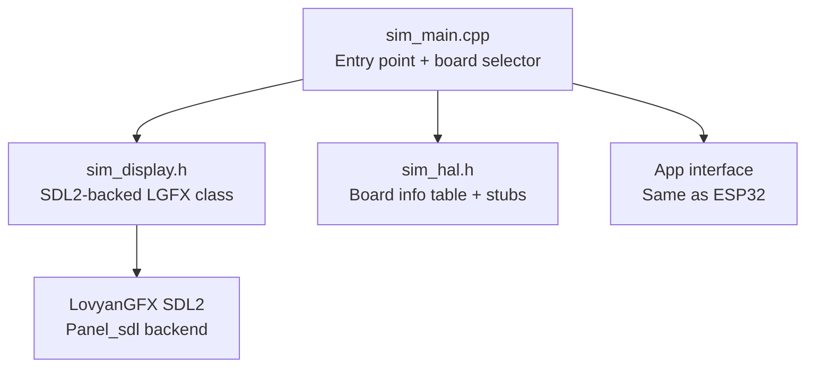

# Desktop Simulator

Desktop simulator for testing apps without hardware. Uses LovyanGFX's SDL2 backend to render in a desktop window at the correct resolution for any supported board.

## Architecture



## Files

| File | Purpose |
|------|---------|
| `sim_main.cpp` | Entry point: parses `--board` flag, creates SDL2 display, runs app loop |
| `sim_display.h` | `LGFX` class wrapping LovyanGFX's `Panel_sdl` for desktop rendering |
| `sim_hal.h` | Board info table (name, resolution, driver) and Arduino API stubs (`millis()`, `Serial`, etc.) |

## Usage

```bash
# Build the simulator
pio run -e simulator

# Run with default board (touch-amoled-241b, 450x600)
.pio/build/simulator/program

# Run with a specific board
.pio/build/simulator/program --board touch-lcd-35bc

# Available boards
.pio/build/simulator/program --board unknown  # prints list
```

> **Note:** Small displays (< 300px in either dimension) are automatically 2x scaled for visibility. The simulator uses the same `App` interface as the ESP32 firmware, so apps run identically on desktop and hardware.

## Prerequisites

Requires SDL2:

```bash
sudo apt install libsdl2-dev
```
