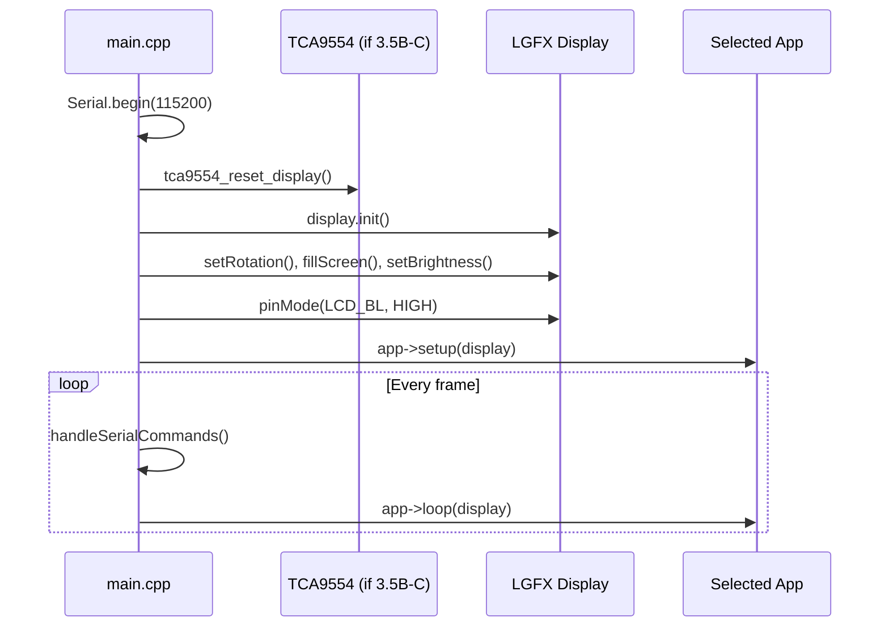

# src/

Firmware entry point for all ESP32-S3 boards. Contains `main.cpp` which initializes the display and runs the selected app.

## Boot Flow

## What main.cpp Does

- **App selection**: Compile-time via `APP_*` preprocessor flags. The `#if defined(APP_*)` chain instantiates the correct app class.
- **Board init**: The `LGFX` class (from `display_init.h`) handles board-specific display configuration. Special boards like the 3.5B-C need an I/O expander reset before `display.init()`.
- **Serial commands**: The firmware listens for `IDENTIFY\n` on serial and responds with JSON board info for the `identify.sh` / `detect_boards.py` tools.
- **Main loop**: Just calls `app->loop(display)` plus serial command handling.

> **Note:** This is intentionally thin — all application logic lives in `apps/`, all hardware abstraction in `lib/hal_*/`, and all display config in `include/display_init.h`.
